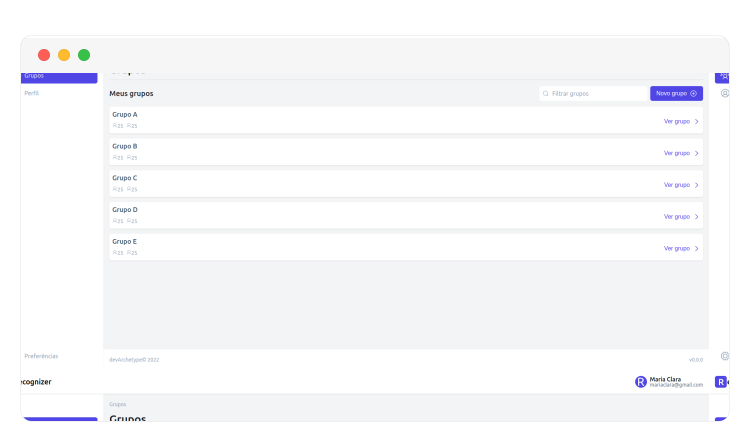

# Recognizer Frontend


[](LICENSE.md)

---

## 🤔 Sobre

**Recognizer** é uma plataforma destinada a leitura e correção de gabaritos, proporcionando uma correção mais eficiente e precisa. Acesse agora a plataforma: [⤤ Ir para Recognizer](http://recognizer.vercel.app/).

Este repositório contém todo o código que compõe o frontend do projeto, os demais repositórios podem ser acessados em: [⤤ Recognizer Backend](https://github.com/devArchetype/recognizer-backend) e [⤤ Recognizer AI](https://github.com/devArchetype/recognizer-AI).



## 📁 Como executar

Para executar o projeto localmente, através do terminal:
1. Clone o repositório do projeto:
    ```bash
    # HTTPS
    git clone https://github.com/devArchetype/recognizer-frontend.git

    # SSH
    git clone git@github.com:devArchetype/recognizer-frontend.git

    ```
2. Acesse o repositório:
    ```bash
    cd recognizer-frontend
    ```
3. Instale as dependências:
    ```bash
    npm install
    ```
4. Execute o projeto:
    ```bash
    npm run dev
    ```

> PS: Algumas funcionalidades do projeto dependem do **backend**. Para instalar e configurar acesse os seguintes repositórios: [Recognizer Backend](https://github.com/devArchetype/recognizer-backend) e [Recognizer AI](https://github.com/devArchetype/recognizer-AI).

## 🔧 Tecnologias

O projeto foi desenvolvido utilizando as seguintes tecnologias:

✔️ [TypeScript](https://www.typescriptlang.org/)

✔️ [ReactJS](https://reactjs.org/)

✔️ [Styled Components](https://styled-components.com/)

✔️ [Vite](https://vitejs.dev/)

## 👨‍💻 Desenvolvedores

- [Riquelme Damião](https://github.com/the-riquelme)
- [Paloma Bárbara](https://github.com/palomabarbara)
- [Marcus Vinícius](https://github.com/pymarcus)
- [João Gabriel](https://github.com/Gabrieljr42)
- [Isaac Santiago](https://github.com/eoisaac)

---